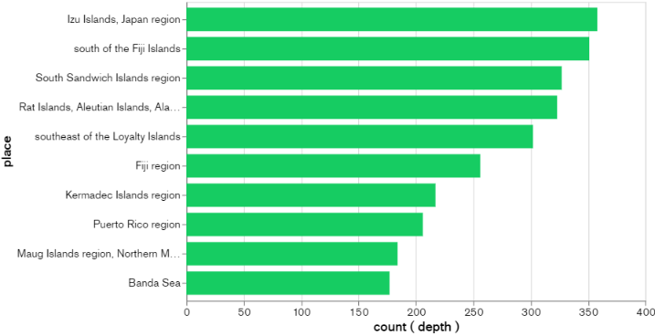

# 🌍 Global Earthquake Analysis (2023)

This project explores and visualizes global earthquake data from 2023 to uncover geographic and geophysical patterns in seismic activity. Using data science tools, geospatial mapping, and MongoDB, the project identifies trends in magnitude, depth, and regional hotspots of earthquakes.

## 📁 Repository Contents

- `664_final.ipynb` – Jupyter notebook containing all data preprocessing, EDA, and clustering logic.
- `AIT664_Project_FinalReport.pdf` – Final report describing methods, insights, and conclusions.
- `cleaned_earthquakes.csv` – Preprocessed dataset used for modeling and visualization.
- `earthquakes_2023_global.csv` – Original dataset with global earthquake records from 2023.
- `664_visualizations.twbx` – Tableau dashboard for interactive visual analytics.
- `interactive_clustered_earthquake_map2.html` – Web-based clustered map visualization.
- `Mongo_db visualization-1.png`, `mongodb_visualization-2.png` – Screenshots from MongoDB Compass analysis.

## 🎯 Objectives

- Analyze global earthquake data to identify patterns in magnitude and depth.
- Visualize geographic clustering of seismic activity.
- Leverage MongoDB for document-based storage and aggregation.
- Use unsupervised learning to cluster earthquakes by features such as magnitude and depth.

## 🧪 Technologies Used

- **Python**: pandas, seaborn, folium, scikit-learn
- **MongoDB**: Document-based storage for querying and filtering earthquake records
- **Tableau**: For dynamic visualizations and dashboards
- **Jupyter Notebook**: For data preprocessing, analysis, and modeling
- **Folium & HTML**: For interactive geospatial mapping

## 📊 Key Features

- **Clustering**: K-means clustering to group earthquakes based on depth and magnitude.
- **Geospatial Mapping**: Folium-based interactive map showing clustered seismic activity.
- **Tableau Dashboards**:
  - Top 10 earthquake-prone regions by magnitude
  - Depth distribution across global regions
- **MongoDB Integration**: Data inserted into MongoDB for flexible querying and pattern analysis.

## 🌐 Insights

- **Izu Islands** and **Fiji Islands** had the highest frequency of high-magnitude earthquakes in 2023.
- The **deepest earthquakes** occurred near the **South Sandwich Islands** and **Japan Trench** regions.
- Clustering revealed distinct groupings of shallow vs deep earthquakes.

## 📜 Data Source

- [USGS Earthquake Catalog](https://earthquake.usgs.gov/earthquakes/search/) – Global seismic data for 2023.

## 🗺️ Visualization Preview

